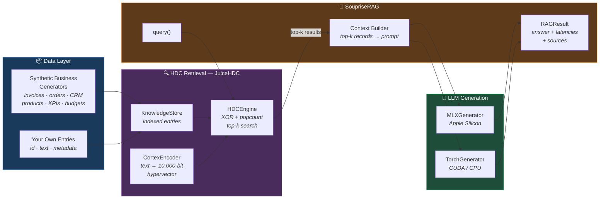
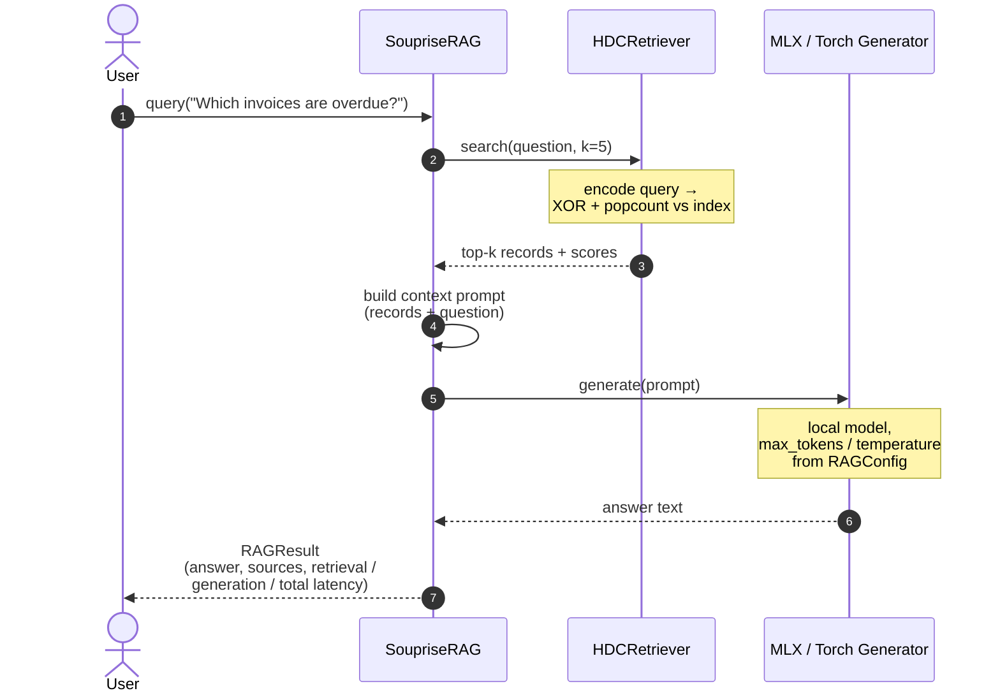
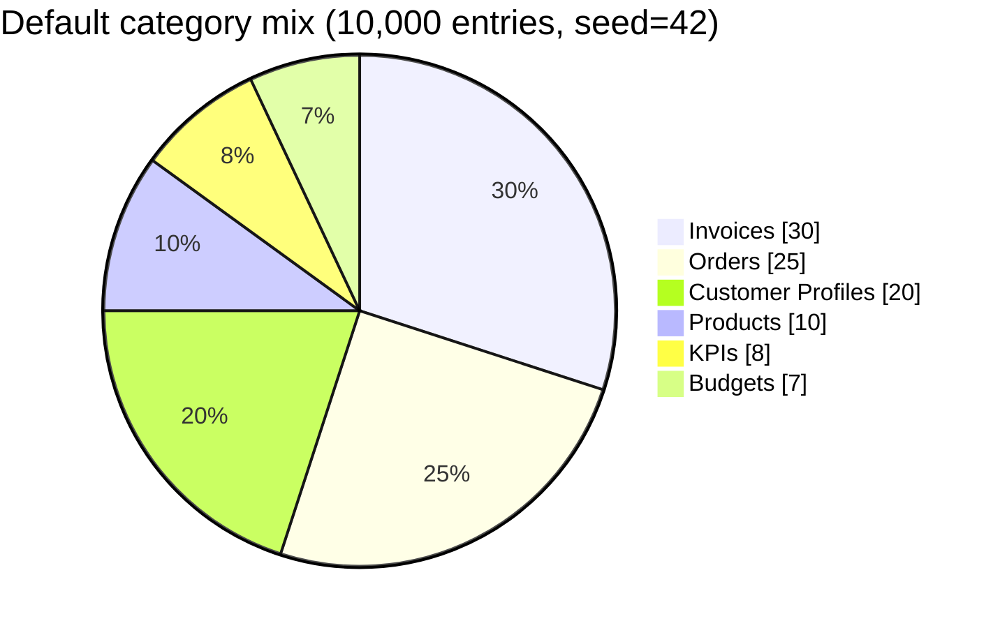
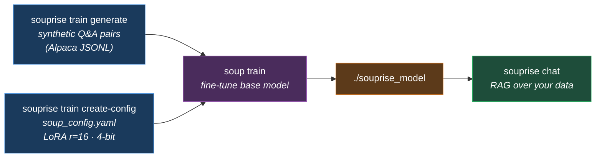
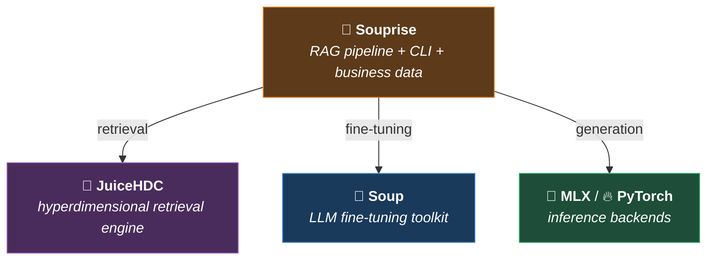

<div align="center">

# 🍲 Souprise

### Offline RAG for Business Data

**Hyperdimensional Computing retrieval · Fine-tuned LLM generation · No cloud at runtime**

[](LICENSE)
[](https://www.python.org/)
[](#project-status)
[](https://github.com/astral-sh/ruff)
[](https://github.com/ml-explore/mlx)

*Ask questions about your invoices, orders, customers, and KPIs —*
*queries run on your machine, and your data never leaves it.*

</div>

---

## What is Souprise?

Souprise is a **Retrieval-Augmented Generation (RAG) pipeline** built for business data that must stay on-premises. Instead of embedding vectors from a cloud API, it uses **Hyperdimensional Computing (HDC)**: every record is encoded as a 10,000-bit binary hypervector, and similarity search is a vectorized XOR + popcount — compact (**1,250 bytes of index per entry**, plus the record text itself), fast, and fully deterministic.

Retrieval feeds a **local LLM** — fine-tuned on your domain with [Soup](https://github.com/MakazhanAlpamys/Soup) — running on the **MLX** backend (Apple Silicon) or **PyTorch** (CUDA/CPU).

```
┌─────────────────────────────────────────────────────────┐
│   Your laptop / server — no API keys, no cloud calls    │
│                                                         │
│   Business records ──► HDC index ──► Local LLM ──► 💬   │
└─────────────────────────────────────────────────────────┘
```

> **Network honesty:** the quickstart examples pull a base model once from Hugging Face (e.g. `mlx-community/Phi-2-4bit`). After that — or if you point `model_path` at a local directory — Souprise runs fully offline, air-gap included. Your business data is never sent anywhere at any time.

<details>
<summary><b>Jargon in 30 seconds</b></summary>

- **HDC (Hyperdimensional Computing)** — represents text as very long binary vectors (here: 10,000 bits); similar texts get similar bit patterns, so search is cheap bitwise math instead of neural network inference.
- **Soup** — an open-source CLI for fine-tuning LLMs with LoRA on Apple Silicon (MLX) or CUDA.
- **LoRA** — a fine-tuning method that trains small adapter matrices instead of the whole model; `r` and `alpha` control adapter size and strength.
- **Alpaca format** — a simple JSONL layout for training examples: `instruction`, `input`, `output`.
- **MLX** — Apple's machine-learning framework for M-series chips.

</details>

### Why HDC instead of dense embeddings?

| | HDC hypervectors (Souprise) | Dense embedding models |
|---|---|---|
| **Encoding** | Deterministic binary vectors, no model inference | Requires an embedding model pass |
| **Storage (vector only)** | 1,250 bytes / entry (10,000 bits) | 1.5–6 KB / entry (float32/16) |
| **Similarity** | XOR + popcount (bitwise, SIMD-friendly) | Dot product / cosine (float math) |
| **Dependencies** | NumPy + [JuiceHDC](https://github.com/mkupermann/JuiceHDC) | Embedding model + vector DB |
| **Offline** | ✅ Always | ⚠️ Depends on the model/service |

---

## Architecture



### Query lifecycle



Every `RAGResult` carries its own instrumentation — `retrieval_latency`, `generation_latency`, `total_latency` — so you can measure performance on **your** hardware and data instead of trusting someone else's benchmark table.

---

## Quick Start

### 1 · Install

```bash
git clone https://github.com/mkupermann/souprise.git
cd souprise

# Core + HDC retrieval + dev tools
pip install -e ".[retrieval,dev]"
```

<details>
<summary><b>Platform-specific installs</b></summary>

```bash
# Apple Silicon (M1–M4) — MLX backend
pip install -e ".[retrieval]" mlx mlx-lm

# CUDA GPUs — PyTorch backend
pip install -e ".[retrieval]"
pip install torch --index-url https://download.pytorch.org/whl/cu121

# CPU only
pip install -e "."
```

</details>

### 2 · Three commands to a working RAG

```bash
# Generate 10,000 synthetic business Q&A pairs (Alpaca format)
souprise train generate --output-path data/business_training.jsonl --n 10000

# Fine-tune a small local model with Soup (config generated for you)
souprise train create-config --model mlx-community/Phi-2-4bit --backend mlx
soup train --config soup_config.yaml

# Chat with your data
souprise chat --model ./souprise_model --backend mlx
```

### 3 · Or use it as a library

```python
from souprise import quickstart

# Indexes 10k synthetic business records + loads a local model
rag = quickstart(n_data=10_000, model_path="mlx-community/Phi-2-4bit")

result = rag.query("What are the open invoices for Customer_0123?")

print(result.answer)
print(f"retrieval : {result.retrieval_latency*1000:6.2f} ms")
print(f"generation: {result.generation_latency*1000:6.2f} ms")
print(f"total     : {result.total_latency*1000:6.2f} ms")
```

Bring your own data with three fields per record:

```python
from souprise import SoupriseRAG
from souprise.core.pipeline import RAGConfig

rag = SoupriseRAG(RAGConfig(backend="mlx", model_path="./souprise_model"))
rag.index_from_entries([
    {"id": "INV-2025-001",
     "text": "Invoice ACME Corp\nAmount: $12,400\nStatus: overdue\nDue: 15 Mar 2025",
     "metadata": {"tags": ["invoice", "overdue"]}},
    # ... your ERP/CRM exports
])
rag.load_model()
```

---

## Synthetic Business Data

Souprise ships generators for six ERP/CRM entity types — seeded, reproducible, and containing **no real customer information**. Ideal for fine-tuning experiments and retrieval testing before you connect real data.



| Entity | Generated fields |
|---|---|
| 🧾 **Invoice** | customer, amount, status (paid/open/overdue/cancelled), region, department, due date |
| 📦 **Order** | customer, product, quantity, unit price, total, fulfillment status |
| 👤 **Customer** | annual revenue, segment (A/B/C/Enterprise), region, contact, open tickets |
| 🏷️ **Product** | stock, price, margin, 30-day sales, trend |
| 📈 **KPI** | department, metric, quarterly value vs. target, status |
| 💰 **Budget** | department, allocated, spent, remaining, utilization |

Each entry converts to three formats: retrieval (`to_retrieval_format`), plain dict, or **Alpaca** (`to_alpaca_format`) for Soup fine-tuning.

---

## Fine-Tuning Workflow



Default Soup config (generated by `create-config`): LoRA `r=16, alpha=32, dropout=0.05`, 4-bit quantization, 3 epochs, lr `2e-5`, 10 % validation split.

---

## CLI Reference

| Command | Purpose |
|---|---|
| `souprise chat` | Interactive RAG chat session |
| `souprise chat query "<question>"` | One-shot question |
| `souprise train generate` | Generate Alpaca-format training data |
| `souprise train create-config` | Write a Soup fine-tuning config |
| `souprise train all` | Data + config in one step |
| `souprise index` | Manage the HDC index |
| `souprise info` | Show installed backends and versions |
| `souprise version` | Show version |

## Configuration

```python
from souprise.core.pipeline import RAGConfig

config = RAGConfig(
    retrieval_k=5,                          # top-k records fed into the prompt
    model_path="mlx-community/Phi-2-4bit",  # local path or HF ID
    backend="mlx",                          # "mlx" (Apple Silicon) | "torch" (CUDA/CPU)
    max_tokens=256,
    temperature=0.7,
)
```

---

## Project Status

**Alpha (v0.1.0).** The pipeline, CLI, and data generators work; the benchmark suite and persistence layer are in progress. Performance numbers are deliberately **not** published here — run `rag.query()` and read the latencies from `RAGResult` on your own hardware.

| | Milestone | Highlights |
|---|---|---|
| ✅ | **v0.1** | HDC retrieval, MLX/Torch generation, CLI, synthetic data generators |
| 🔜 | **v0.2** | Persistent HDC storage (SQLite), Postgres connector, REST API, multi-turn chat, standardized benchmark suite |
| 🗓️ | **v0.3** | SAP & DATEV integration, Excel/CSV importers, auth & RBAC, multi-tenant |
| 🎯 | **v1.0** | Production deployment options, observability, 1M+ entries, HD-NSW index |

---

## Ecosystem

Souprise is the integration layer between two sibling projects:



- [JuiceHDC](https://github.com/mkupermann/JuiceHDC) — Apache-2.0 — HDC encoding, storage, and search
- [Soup](https://github.com/MakazhanAlpamys/Soup) — Apache-2.0 — LoRA fine-tuning for MLX and PyTorch
- [MLX](https://github.com/ml-explore/mlx) — Apache-2.0 — Apple Silicon ML framework

## Development

```bash
pip install -e ".[dev]"
pytest tests/          # run tests
ruff check souprise/   # lint
```

Contributions welcome — see [CONTRIBUTING.md](CONTRIBUTING.md).

## License

Apache License 2.0 — see [LICENSE](LICENSE) and [NOTICE](NOTICE) for third-party attributions.

## Citation

```bibtex
@misc{souprise2026,
  author = {Michael Kupermann},
  title  = {Souprise: Offline RAG for Business Data},
  year   = {2026},
  url    = {https://github.com/mkupermann/souprise}
}
```

---

<div align="center">

**Questions?** [Issues](https://github.com/mkupermann/souprise/issues) · [Discussions](https://github.com/mkupermann/souprise/discussions) · michael@kupermann.com

</div>
