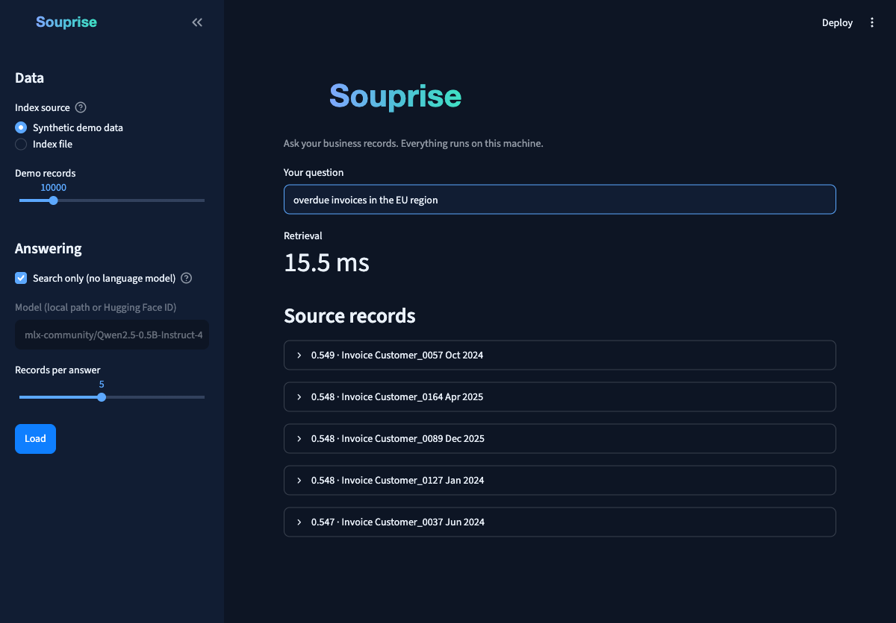

<p align="center">
  
</p>

<div align="center">

[](https://github.com/mkupermann/souprise/actions/workflows/ci.yml)
[](LICENSE)
[](https://www.python.org/)
[](#platform-support)
[](#project-status)
[](https://github.com/astral-sh/ruff)

</div>

> Ask questions about invoices, orders, customers and KPIs, on your own hardware, and get answers that are **correct by construction**: in the default verified mode every value is copied verbatim from your records, never generated. It all runs locally; point `model_path` at a local folder and nothing ever touches the network.

## The One Principle

> **Souprise doesn't sell answers. It sells the certainty that the answer is correct.**

Every design decision passes this test. If a feature endangers correctness even marginally, it stays out. If a feature increases traceability, it goes in. **Correctness is priority one, speed is priority two.** Three hard guarantees, each measured against pre-registered bars ([verified-mode report](benchmarks/results/verified_report.md)):

1. **No generated figures.** The default [verified mode](#verified-answers) keeps the language model off the factual path — values are copied from cited records. Measured value accuracy: **1.000**.
2. **Refusal beats guessing.** Unknown entities and weak retrieval get an explicit refusal, never the closest lookalike. Measured refusal rate on unknown entities: **1.000**; wrong values under conflicting records: **0.000** (all candidates are listed instead).
3. **A hard gate on the generative mode.** Opting into LLM answers puts every figure through a grounding gate; anything not present in the retrieved records is replaced by the verified fallback before it ships. Measured shipped-fabrication rate: **0.000**.

Access control follows the same rule. **Record-level permissions are enforced before search**: a role's visibility mask is applied to the hypervector index before any distance is computed, so similarity scores over forbidden records never exist and cannot leak through ranking or answers. Field masks strip hidden values (a margin column, say) from answers, record dumps and aggregations, and an append-only audit log records every query with record hashes and an answer hash, immutability enforced by the database itself. Measured against pre-registered bars: **0 leaks across 200 policy queries, denial rate 1.000 on forbidden targets** ([RBAC report](benchmarks/results/rbac_report.md)). Pass a JSON policy with `--policy` and a log path with `--audit`. The honest limit: policies are in-process objects — user authentication and principal management arrive with the REST API (v0.3, [#29](https://github.com/mkupermann/souprise/issues/29)).

<p align="center">
  <br>
  <sub>Recorded live on an Apple M-series laptop, nothing cut. The whole stack is loaded (MLX, JuiceHDC, Soup), 10,000 records index in 8 s with a 3.6 ms median query, and a local Qwen 0.5B answers a grounded question in 1.4 s. One machine's numbers, not a promise. Run <code>benchmarks/retrieval_bench.py</code> and get your own.</sub>
</p>

---

## What is Souprise?

Souprise is a toolkit for building business AI that stays in the building. Retrieval-augmented generation is the runtime path, but the repo covers the whole route from raw data to grounded answers. Four parts, each useful on its own. Not an engineer? The one-page [decision maker brief](docs/FOR_DECISION_MAKERS.md) covers the cost argument and the honest limits.

| Component | What it does | Standalone use |
|---|---|---|
| Synthetic data generators | Seeded, reproducible ERP/CRM records and Alpaca-format Q&A pairs | Fine-tuning experiments and retrieval benchmarks before real data is connected |
| Fine-tuning workflow | Turns a base model into your domain model. Data generation, Soup/LoRA configuration, training orchestration | Produce a business-tuned LLM for any downstream use |
| HDC retrieval engine | Deterministic 10,000-bit hypervector search, NumPy only | A search library for your own applications, no LLM required |
| RAG runtime + CLI | Retrieves relevant records and has your local model answer from them, fully instrumented | Grounded question answering over ERP and CRM data |

You need five terms for the rest of this page.

- **HDC (Hyperdimensional Computing).** Text becomes a very long binary vector, 10,000 bits here. Similar texts get similar bit patterns, so search is cheap bitwise math instead of model inference.
- **MLX.** Apple's ML framework for M-series chips. PyTorch covers every other machine.
- **Soup.** An open-source CLI that fine-tunes LLMs with LoRA, on MLX or PyTorch.
- **LoRA.** Fine-tuning through small adapter matrices instead of the whole model. `r` and `alpha` set adapter size and strength.
- **Alpaca format.** A plain JSONL layout for training examples with `instruction`, `input` and `output` fields.

Most RAG stacks run an embedding model plus a vector database. Souprise skips both. No neural network runs at indexing or search time, results are deterministic, and the index occupies exactly **1,250 bytes per entry**. Every record becomes a 10,000-bit hypervector. Search is a vectorized XOR plus popcount over the packed index, written in plain NumPy in this repository and pinned down by the test suite.

The retrieved records go to a local LLM, which you can fine-tune on your domain with [Soup](https://github.com/MakazhanAlpamys/Soup). And like Soup, Souprise doesn't care what machine you own. It detects MLX on Apple Silicon and falls back to PyTorch on NVIDIA CUDA, AMD ROCm or plain CPU. Same code, same commands, on Linux, macOS and Windows.

**What touches the network, exactly.** The built-in retriever has no network path, full stop. `quickstart()` pulls a public base model from Hugging Face once, no API key needed. Point `model_path` at a local folder instead and there's no download and no connection at all, air gap included. Fine-tuning with Soup runs on your hardware too. Your business data is never sent anywhere, at any time. One caveat, and it's yours to own. If you inject a custom `BaseRetriever` or `BaseGenerator`, nobody can vouch for its network behavior but you.

## What Your Teams Can Ask

Souprise answers from your records, so the useful questions are the ones your teams already ask every day.

| Team | Questions that work against the shipped data model | Backed by |
|---|---|---|
| Sales | Which invoices for Customer_0123 are overdue? What did a customer order last quarter, and for how much? Which A-segment customers in the EU haven't been contacted since March? | Invoices, orders, customer profiles |
| Marketing | Which products are trending down despite high stock? What segment and region is Customer_0042 in? How is the marketing budget for 2025 tracking against its allocation? | Products, segments, KPIs, budgets |
| Service | Which enterprise customers sit on more than five open tickets? What's the fulfillment status of a customer's last order? Which departments miss their satisfaction targets? | Customer profiles, orders, KPIs |

Three honest notes on this. First, the shipped generators produce synthetic data, so you can try all of these questions in the demo before any real record is involved. Second, connecting real data works today through `souprise index build` with CSV, Excel, JSONL or a PostgreSQL query (see [Persistent Indexes and Connectors](#persistent-indexes-and-connectors)). Native SAP and DATEV integration is a roadmap item (v0.3), not a current feature.

Third: **numbers never come from the model.** Point lookups copy values from records (verified mode). Aggregate questions — totals, counts, averages with filters like "all overdue invoices" — are computed deterministically in code over the whole index with Decimal arithmetic, measured exact against an independent reference in 40 of 40 cases ([report](benchmarks/results/compute_report.md)). Aggregates outside the parser's vocabulary get an honest hint, never a guessed figure.

## Verified Answers

Fabricated figures can't be reliably suppressed inside a language model, so the default mode takes the model off the factual path entirely. In **verified mode**, a rule-based detector maps your question to a record field and the value is **copied verbatim from the record, never generated**. If the question names an entity the corpus doesn't have, Souprise refuses instead of returning the closest lookalike. If multiple records of the same entity disagree, you get all candidate values listed, not a guess. No model is even loaded, which also makes it fast.

Measured against the pre-registered BENCH-5 bars ([report](benchmarks/results/verified_report.md)): value accuracy **1.000** on 60 lookups, wrong-value rate **0.000** under entity ambiguity, refusal rate **1.000** on unknown entities. Entity verification covers natural company names too, via a vocabulary built from your index — known names answer at **1.000**, invented companies are refused at **1.000** ([BENCH-7 report](benchmarks/results/coverage_report.md)). And to counter the obvious objection that the parser only understands its author's phrasing: a frozen 70-question set written by a *different* model reaches **1.000 coverage** on the answerable questions, up from an honestly published 0.516 baseline. The generative mode stays available with `--mode generative` and sits behind a hard gate: an answer containing any figure not present in the retrieved records is replaced by the verified fallback before it ships — measured shipped-fabrication rate with the real local model: **0.000**.

The division of labor is strict: **the LLM may write prose, code owns every number.** Aggregates (sum, count, average, min, max with filters) are computed deterministically over the whole index — exactness 1.000 against an independent reference. And if you want natural sentences instead of terse facts, `--mode styled` lets the model phrase the deterministic answer behind an exact-figure gate: any altered number and the deterministic text ships instead ([BENCH-6 report](benchmarks/results/compute_report.md), shipped-mismatch rate 0.000 with the real model).

```bash
souprise chat query "What is the amount of the invoice for Customer_0042?"      # verified, default
souprise chat query "What is the total amount of all overdue invoices?"         # computed in code
souprise chat query "What is the amount for Customer_0042?" --mode styled       # LLM phrases, code owns numbers
souprise chat query "Summarize Customer_0042's situation" --mode generative     # gated LLM
```

Precisely stated: verified answers guarantee that every value comes verbatim from a cited record, and computed answers are exact over the records the index holds. Neither guarantees the record itself is right — keep one current record per entity, and Souprise repeats your data faithfully.

## Design Principles

| Principle | Implementation |
|---|---|
| Correctness first, speed second | Verified mode copies values from records instead of generating them; gates and refusals before eloquence. Fast anyway, but that's the bonus, not the goal |
| Data sovereignty | Indexing, retrieval and generation run locally. No telemetry, no API keys at runtime |
| Infrastructure-neutral | Linux, macOS and Windows. Backend auto-detection picks MLX or PyTorch per machine |
| Verifiable claims | The HDC retriever ships in this repository, its storage and search behavior are covered by tests, and every `RAGResult` reports its own latencies |
| Lean core | Three dependencies (NumPy, Typer, Rich). Backends and optional engines install via extras |
| Pluggable architecture | `BaseRetriever` and `BaseGenerator` interfaces. Any implementation can be injected |

## Platform Support

<p align="center">
  
</p>

`backend="auto"` is the default and does what you'd expect. MLX where it exists, PyTorch everywhere else, plus a matching small base model unless you name one. Any Hugging Face causal LM works as `model_path`. Mistral, Llama, Qwen, Phi, or your own fine-tuned checkpoint. The shipped defaults were picked for download size, nothing else.

Two honest notes on scope. Souprise is optimized for **small local models (0.5B to 7B parameters)** running on a single machine — the verified mode needs no model at all, and [our measurements](benchmarks/results/finetune_report.md) show a deduplicated corpus matters more than model size. If you need a 70B-class model, serve it yourself (vLLM or any OpenAI-compatible server on your own hardware) and plug it in as a custom `BaseGenerator`; a first-class integration is tracked in [#53](https://github.com/mkupermann/souprise/issues/53). And on dependencies: the core has none beyond NumPy, Typer and Rich. [Soup](https://github.com/makazhanAlpamys/soup) (fine-tuning) and [JuiceHDC](https://github.com/mkupermann/JuiceHDC) (alternative retrieval engine) are optional extras — if either project ever stops moving, Souprise keeps working, because the default retriever and the verified path live in this repository.

## Architecture

<p align="center">
  
</p>

### Query lifecycle

<p align="center">
  
</p>

You won't find performance claims in this README, and that's on purpose. Every `RAGResult` carries its own retrieval, generation and total latency, and `benchmarks/retrieval_bench.py` measures index build and query time where it counts, on your machine. Plan with your numbers, not ours.

## Retrieval at Scale

The built-in retriever doesn't stop at 10,000 records.

- **Exact, chunked search.** Hamming distances are computed in fixed-size blocks, so temporary memory stays near 80 MB at the default `chunk_rows` of 65,536, no matter how big the corpus gets. The tests prove chunked and unchunked search return identical results.
- **Top-k by argpartition.** O(n) selection, no full sort.
- **Hardware popcount over 8-byte words** (padded uint64 views) on NumPy 2.x, lookup-table fallback on older versions. 1M records answer in 136 ms median, exactly.
- **Two failed speedup candidates, published.** A sketch prefilter and a richer encoding both lost against their pre-registered bars; the simple exact design won ([report](benchmarks/results/bench8_report.md)).
- **Incremental indexing.** `add(entries)` appends new records without re-encoding what's already there.
- **Linear storage.** 1,250 bytes per entry, so 100,000 records need 125 MB of index.

<p align="center">
  <br>
  <sub>Same laptop, same exact search, two corpus sizes. 10,000 records index in 8 s and answer in 3.8 ms. One million records build 1.25 GB of index in just under 8 minutes and answer in 371 ms median, with 20 of 20 self-retrieval hits. Since that recording, an exact-path optimization (hardware popcount over 8-byte words) brought the 1M median down to 136 ms with zero accuracy trade-off ([BENCH-8 report](benchmarks/results/bench8_report.md)). The recording pauses during the long build, nothing else is cut. One machine's numbers, not a promise.</sub>
</p>

```bash
# Measure on your own machine, any corpus size
python benchmarks/retrieval_bench.py --n 100000 --queries 50
```

### Measured against BM25

Retrieval quality is benchmarked, not asserted. A pre-registered protocol ([benchmarks/PROTOCOL.md](benchmarks/PROTOCOL.md), bars committed before the run) pits the built-in retriever against a plain BM25 baseline on 200 paraphrased business lookups over 5,000 records.

| System | Recall@5 | MRR@5 |
|---|---|---|
| Built-in HDC | 1.000 | 1.000 |
| BM25 | 0.965 | 0.908 |

Honest reading, spelled out in the [full report](benchmarks/results/recall_report.md): both systems sit near the ceiling because business lookups carry unique identifiers, so this shows HDC holds up on the lookup class Souprise targets. It does not measure identifier-free semantic search, where an embedding model would be expected to win. Rerun it yourself with `PYTHONPATH=. python3 benchmarks/recall_bench.py`.

When an exact linear scan stops being fast enough for you, swap in the optional [JuiceHDC](https://github.com/mkupermann/JuiceHDC) engine with `pip install -e ".[juicehdc]"` and `RAGConfig(retriever="juicehdc")`. An HD-NSW approximate index is planned for v1.0.

| | `SimpleHDCRetriever` (default) | `HDCRetriever` (JuiceHDC) |
|---|---|---|
| Installation | None. Included, NumPy only | `pip install -e ".[juicehdc]"` |
| Encoding | Token bundling, deterministic BLAKE2b-seeded hypervectors | JuiceHDC `CortexEncoder` with typed tokens and character n-grams |
| Search | Exact XOR + popcount, chunked, O(n) top-k | Managed by JuiceHDC |
| Intended use | Default for any corpus, air-gapped installs | Advanced encoding, larger corpora |

Anything that implements `BaseRetriever` (`index`, `search`, `clear`) can be assigned to `rag.retriever` directly. Same for `BaseGenerator` and custom inference backends.

## Persistent Indexes and Connectors

Encoding happens once, not on every start. `souprise index build` writes a self-contained SQLite file with the entries and the packed hypervector matrix, and loading it back takes seconds because nothing gets re-encoded. Your data comes in through four doors.

```bash
# From a CSV export (delimiter is sniffed, works with ; and tab too)
souprise index build --from-csv invoices.csv --id-column invoice_id --tag-columns status

# From an Excel workbook
souprise index build --from-xlsx export.xlsx --sheet Invoices --id-column invoice_id

# Straight from PostgreSQL
souprise index build --from-postgres postgresql://user@localhost/erp \
    --query "SELECT id, customer, amount, status FROM invoices" --id-column id

# Inspect and search the index without loading any model
souprise index info --path souprise_index.db
souprise index query "overdue invoices ACME" --path souprise_index.db

# Chat against the persistent index
souprise chat --index souprise_index.db --model ./souprise_model
```

The same works in code through `souprise.data.importers` (`load_csv`, `load_excel`, `load_jsonl`, `load_postgres`) and `SimpleHDCRetriever.save(path)` / `SimpleHDCRetriever.load(path)`. Rows are rendered as plain "Column: value" text, the same shape the synthetic generators produce, so a model fine-tuned on the synthetic data feels at home with your real records. The Postgres path is covered by a round-trip test against a real database in CI.

### Daily updates, no retraining

New data does not mean new training. The facts live in the index, not in the model's weights, so appending today's records makes them answerable immediately. `souprise index add` loads the existing index, encodes only the delta (around 2,000 entries per second), and saves. A thousand new invoices land in about a second.

```bash
# Nightly job: append today's records to the standing index
souprise index add --path souprise_index.db \
    --from-postgres postgresql://user@localhost/erp \
    --query "SELECT id, customer, amount, status FROM invoices WHERE created_at::date = CURRENT_DATE" \
    --id-column id

# Or from a daily export
souprise index add --path souprise_index.db --from-csv todays_invoices.csv --id-column invoice_id
```

The fine-tuned model only needs retraining when the shape of your data changes, new record types or new fields, not when new rows arrive. Day-to-day freshness is an index append, and the append is covered by the test suite.

<p align="center">
  <br>
  <sub>Recorded live. A 10,000-record index gets today's three invoices appended in 0.24 s, the new record is the top hit immediately, and the local model answers with the correct status and amount. No training happened anywhere in this clip.</sub>
</p>

## Installation

The fastest look is one command, no Python setup needed. It builds a local container with the web interface and sample data, nothing leaves your machine.

```bash
git clone https://github.com/mkupermann/souprise.git && cd souprise
docker compose up --build      # then open http://localhost:8501
```

For the real thing, install it directly.

```bash
git clone https://github.com/mkupermann/souprise.git
cd souprise

pip install -e .                # core: retrieval, data generators, CLI
```

| Target | Command |
|---|---|
| Apple Silicon inference | `pip install -e ".[mlx]"` |
| CUDA / ROCm / CPU inference | `pip install -e ".[torch]"` |
| Fine-tuning with Soup | `pip install -e ".[finetune]"` plus `soup-cli[mlx]` (Apple Silicon) or `soup-cli[train]` (CUDA/CPU) |
| JuiceHDC retrieval engine | `pip install -e ".[juicehdc]"` |
| Excel importer | `pip install -e ".[excel]"` |
| PostgreSQL connector | `pip install -e ".[postgres]"` |
| Web interface | `pip install -e ".[gui]"` |
| Development (tests, lint) | `pip install -e ".[dev]"` |

## Web Interface

`souprise gui` starts a local web interface for everyone who doesn't live in a terminal. Load an index or demo data, ask in plain language, see the answer with its source records and latencies. Search-only mode works without any model.

<p align="center">
  <br>
  <sub>10,000 records loaded, a question answered in 10 ms, every source record one click away. Requires the gui extra.</sub>
</p>

## Quick Start

Committed sample data lives in [examples/](examples/), ninety seconds from clone to a working index. The smallest possible start in code. Retrieval only, no model, no download.

```python
from souprise import SimpleHDCRetriever

retriever = SimpleHDCRetriever()
retriever.index([
    {"id": "INV-001", "text": "Invoice ACME Corp amount 12400 status overdue"},
    {"id": "INV-002", "text": "Invoice Globex amount 800 status paid"},
])
print(retriever.search("overdue invoice ACME", k=1)[0].title)   # INV-001
```

The full pipeline with a local LLM.

```python
from souprise import quickstart

# Indexes 10,000 synthetic business records and loads a model.
# Backend and default model are auto-detected for this machine. The base
# model is downloaded once from Hugging Face on first run. Pass
# model_path="./your_local_model" for a fully offline start.
rag = quickstart(n_data=10_000)

result = rag.query("What are the open invoices for Customer_0123?")

print(result.answer)
print(f"retrieval : {result.retrieval_latency * 1000:7.2f} ms")
print(f"generation: {result.generation_latency * 1000:7.2f} ms")
print(f"total     : {result.total_latency * 1000:7.2f} ms")
```

Bring your own data. Three fields per record.

```python
from souprise import SoupriseRAG, RAGConfig

rag = SoupriseRAG(RAGConfig(retriever="simple", model_path="./souprise_model"))
rag.index_from_entries([
    {"id": "INV-2025-001",
     "text": "Invoice ACME Corp\nAmount: $12,400\nStatus: overdue\nDue: 15 Mar 2025",
     "metadata": {"tags": ["invoice", "overdue"]}},
    # ... your ERP/CRM exports
])
rag.load_model()
```

### Command line

```bash
# Generate 10,000 synthetic business Q&A pairs (Alpaca format)
souprise train generate --output-path data/business_training.jsonl --n 10000

# Create a Soup fine-tuning configuration (backend auto-detected), then train
souprise train create-config
soup train --config soup_config.yaml

# Chat with your data. Same command on macOS, Linux or Windows
souprise chat --model ./souprise_model
```

<p align="center">
  <br>
  <sub>An interactive session over 2,000 records, recorded live. Retrieval takes about 35 ms per question, the local 0.5B model answers in about 1.3 s, and every answer names the records it came from. Ctrl+C ends it. No session data leaves the machine.</sub>
</p>

## Synthetic Business Data

Six ERP/CRM entity types ship as generators. Seeded, reproducible, and containing no real customer information. Use them to test fine-tuning and retrieval before any real data gets involved.

| Entity | Generated fields |
|---|---|
| Invoice | customer, amount, status (paid / open / overdue / cancelled), region, department, due date |
| Order | customer, product, quantity, unit price, total, fulfillment status |
| Customer | annual revenue, segment (A / B / C / Enterprise), region, contact, open tickets |
| Product | stock, price, margin, 30-day sales, trend |
| KPI | department, metric, quarterly value versus target, status |
| Budget | department, allocated, spent, remaining, utilization |

The default mix at `seed=42` is 30 % invoices, 25 % orders, 20 % customer profiles, 10 % products, 8 % KPIs and 7 % budgets. Each entry converts to three formats. Retrieval (`to_retrieval_format`), plain dict (`to_dict`), or Alpaca (`to_alpaca_format`) for fine-tuning.

## Fine-Tuning Workflow

1. `souprise train generate` writes synthetic Q&A pairs as Alpaca JSONL. Your own data works in the same format.
2. `souprise train create-config` writes `soup_config.yaml`. Defaults are LoRA `r=16, alpha=32, dropout=0.05`, 4-bit quantization, 3 epochs, learning rate `2e-5`, 10 % validation split.
3. `soup train --config soup_config.yaml --yes` fine-tunes the base model locally and produces `./souprise_model`.
4. `souprise chat --model ./souprise_model` runs RAG over your data with the tuned model, fully offline.

**Measured, honestly: you probably don't need this step.** We ran the whole path for real (Soup/LoRA, 2,600 iterations on 3,883 synthetic examples) and evaluated it under pre-registered bars ([protocol](benchmarks/PROTOCOL.md), [null result](benchmarks/results/finetune_report.md), [failure analysis](benchmarks/results/finetune_analysis.md)). Three findings, all published as measured:

1. Tuning didn't help anywhere. Base setting 0.717 tuned vs 0.733 untuned, harder contexts 0.533 vs 0.533, format fidelity no better.
2. Tuning **memorizes your training values**. With no records in the prompt, the tuned model reproduced training figures at 0.117 vs 0.017 untuned — for daily-changing data that means stale memorized numbers exactly when retrieval comes up empty.
3. What actually fixed the errors was **data hygiene, not models**. Every single miss traced to entities with multiple conflicting records in the corpus. Deduplicating to one current record per entity took the untuned 0.5B from 0.733 to 1.000 — a bigger model (1.5B, 0.717) didn't. Keep stable ids and let `souprise index add`'s upsert semantics maintain one record per entity, and the smallest model reads your data nearly perfectly.

**What fine-tuning IS measurably good for: your company's voice.** `souprise train style` takes a glossary (generic term to company term) and an answer template, and generates training data whose form carries your corporate language while every record value is randomized per run — stable memorization is impossible by construction, which matters for daily-changing data. Measured against the pre-registered BENCH-4 bars: the tuned model answers with company terminology and template structure in **98.3 %** of cases (untuned: 0 %) with no style hints in the prompt, memorization control clean, and factual accuracy holding at the guard limit ([full report including the failed first iteration](benchmarks/results/style_report.md)).

```bash
souprise train style --glossary examples/style/glossary_de.csv \
    --answer-template examples/style/answer_template_de.txt
```

For anything else, measure before assuming tuning helps: `benchmarks/finetune_eval.py` and the memorization control in `benchmarks/style_eval.py` run on your own data.

## CLI Reference

| Command | Purpose |
|---|---|
| `souprise chat` | Interactive RAG chat session |
| `souprise chat query "<question>"` | One-shot question |
| `souprise train generate` | Generate Alpaca-format training data |
| `souprise train create-config` | Write a Soup fine-tuning configuration |
| `souprise train all` | Data and configuration in one step |
| `souprise index build` | Build a persistent index from CSV, Excel, JSONL, PostgreSQL, or synthetic data |
| `souprise index add` | Append new records to an existing index, encoding only the delta |
| `souprise index info` | Show statistics of a persistent index |
| `souprise index query "<question>"` | Search a persistent index without loading an LLM |
| `souprise gui` | Start the local web interface |
| `souprise info` | Show installed backends and versions |
| `souprise version` | Show version |

## Configuration

```python
from souprise import RAGConfig

config = RAGConfig(
    retrieval_k=5,                  # top-k records fed into the prompt
    model_path="./souprise_model",  # local path or any Hugging Face causal LM, e.g.
                                    # "mistralai/Mistral-7B-Instruct-v0.3",
                                    # "meta-llama/Llama-3.2-1B-Instruct",
                                    # "Qwen/Qwen2.5-1.5B-Instruct"
    backend="auto",                 # "auto" | "mlx" (Apple Silicon) | "torch" (CUDA/ROCm/CPU)
    retriever="auto",               # "auto" | "simple" | "juicehdc"
    max_tokens=256,
    temperature=0.7,
)
```

## Testing

The suite runs against the core install alone. No model downloads, no optional extras. It still covers the pipeline end to end.

- `tests/test_hdc_retriever.py` checks the storage claim (10,000 bits are 1,250 bytes per entry), deterministic encoding, retrieval relevance, a 25,000-record scale test, chunked-search equivalence and incremental `add()`.
- `tests/test_pipeline.py` runs the whole query path with the built-in retriever and a stub generator, plus backend resolution and custom-retriever injection.
- `tests/test_data_generators.py` covers reproducibility and format guarantees.
- `tests/test_persistence_importers.py` covers the save/load round trip with identical scores, the CSV, Excel and JSONL importers end to end, and a real-PostgreSQL round trip (runs wherever `SOUPRISE_TEST_PG_DSN` points at a database; CI provides one).

```bash
pip install -e ".[dev]"
pytest tests/
ruff check souprise/ tests/
```

CI runs the suite on Python 3.10 through 3.13 across Linux, macOS and Windows, on every push and pull request.

## Project Status

Alpha, v0.2.0. Pipeline, CLI, built-in retriever, data generators, persistent indexes and the CSV/Excel/JSONL/Postgres doors are built and tested.

| Version | Scope |
|---|---|
| v0.1 | Built-in HDC retrieval (tested to 25k+ records), auto-detected MLX/PyTorch generation, CLI, synthetic data generators, cross-platform CI, retrieval benchmark |
| v0.2 (current) | Persistent SQLite indexes (`souprise index build/info/query`, `--index` in chat), CSV/Excel/JSONL importers, PostgreSQL connector with a real-database CI test |
| v0.2.x | Multi-turn chat, standardized benchmark suite, index-side access policies (`--policy`) and append-only audit log (`--audit`, measured in [BENCH-9](benchmarks/results/rbac_report.md)); REST API in progress |
| v0.3 | SAP and DATEV integration, authentication and principal management via REST API, multi-tenant |
| v1.0 | Production deployment options, observability, HD-NSW approximate index for very large corpora |

## Ecosystem

Souprise plays well with two sibling projects but needs neither.

- [JuiceHDC](https://github.com/mkupermann/JuiceHDC), Apache-2.0. Optional HDC retrieval engine. The built-in retriever covers the default path.
- [Soup](https://github.com/MakazhanAlpamys/Soup), Apache-2.0. LoRA fine-tuning for MLX and PyTorch.
- [MLX](https://github.com/ml-explore/mlx), Apache-2.0. Apple Silicon ML framework.

## Contributing

Contributions are welcome. See [CONTRIBUTING.md](CONTRIBUTING.md) and the [Code of Conduct](CODE_OF_CONDUCT.md). Licensed Apache-2.0 ([LICENSE](LICENSE), third-party attributions in [NOTICE](NOTICE)).

## Citation

```bibtex
@misc{souprise2026,
  author = {Michael Kupermann},
  title  = {Souprise: Private Business AI Toolkit},
  year   = {2026},
  url    = {https://github.com/mkupermann/souprise}
}
```

## Support

[Issues](https://github.com/mkupermann/souprise/issues) · [Discussions](https://github.com/mkupermann/souprise/discussions) · michael@kupermann.com
