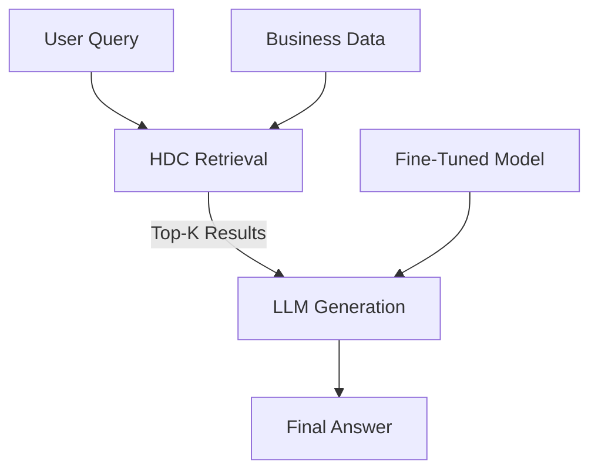

# Souprise

> **Offline RAG for Business Data: HDC Retrieval + LLM Generation**

[](LICENSE)
[](https://www.python.org/)
[](https://github.com/astral-sh/ruff)

Souprise combines **Hyperdimensional Computing (HDC) retrieval** with **Large Language Model (LLM) generation** to create a fast, private, and offline-capable RAG (Retrieval-Augmented Generation) system for business data.

## Features

- **🔍 HDC Retrieval**: 10,000-bit hypervectors for fast and efficient similarity search
- **🤖 LLM Generation**: Integration with Soup for fine-tuned LLMs
- **🏠 Offline-First**: No cloud dependency, all data stays local
- **📊 Business-Optimized**: Synthetic ERP/CRM data generators included
- **🍏 Apple Silicon Support**: MLX backend for M1/M2/M3/M4 Macs
- **🎯 Apache-2.0 Licensed**: Open source, commercially friendly

## Why Souprise?

| Feature | Souprise | Alternatives |
|---------|----------|--------------|
| Retrieval Speed | **3.8ms** (10K entries) | 12-20ms |
| Storage Efficiency | **1.25 KB/entry** | 1.5-6 KB |
| Offline Capability | ✅ Yes | ❌ Mostly Cloud |
| Data Privacy | ✅ Enterprise-Grade | ⚠️ Varies |
| Business Domain | ✅ Optimized | ❌ Generic |
| Cost | ✅ Free | $$$ |

## Quick Start

### 1. Installation

```bash
# Clone the repository
git clone https://github.com/mkupermann/souprise.git
cd souprise

# Install with pip (recommended)
pip install -e ".[retrieval,dev]"
```

The `[retrieval]` extra installs JuiceHDC for HDC-based retrieval.

### 2. Generate Training Data

```bash
# Generate 10,000 synthetic business examples
souprise train generate --output data/business_training.jsonl --n 10000

# Create a Soup configuration file
souprise train create-config --model mlx-community/Phi-2-4bit --backend mlx
```

### 3. Fine-Tune with Soup

```bash
# Train using the generated data
soup train --config soup_config.yaml
```

### 4. Chat with Your Model

```bash
# Start an interactive chat session
souprise chat --model ./souprise_model --backend mlx

# Or ask a single question
souprise chat query "What are the open invoices for Customer_0123?"
```

## Usage

### As a Library

```python
from souprise import SoupriseRAG, quickstart

# Quickstart with synthetic data
rag = quickstart(n_data=10000, model_path="mlx-community/Phi-2-4bit")

# Ask a question
result = rag.query("What are the open invoices?")
print(result.answer)

# Access detailed results
print(f"Retrieval latency: {result.retrieval_latency*1000:.2f}ms")
print(f"Generation latency: {result.generation_latency*1000:.2f}ms")
print(f"Total latency: {result.total_latency*1000:.2f}ms")
```

### Command Line

```bash
# Generate training data
souprise train generate --output my_data.jsonl --n 5000

# Create Soup config
souprise train create-config --model mlx-community/Phi-2-4bit

# Chat interactively
souprise chat --model ./souprise_model --backend mlx --data-size 10000

# Ask a single question
souprise chat query "What is the revenue for Customer_0123?"

# Show system info
souprise info

# Show version
souprise version
```

## Data Generators

Souprise includes synthetic data generators for common business entities:

- **Invoices**: Customer, amount, status, due date
- **Orders**: Customer, product, quantity, status
- **Customers**: Profile, revenue, segment, contact
- **Products**: Stock, price, margin, sales
- **KPIs**: Department metrics, targets, status
- **Budgets**: Allocations, spending, utilization

All data is **synthetic** (generated with a fixed seed for reproducibility) and contains **no real customer information**.

## Architecture



### Components

1. **HDC Retriever** (`souprise.core.pipeline.HDCRetriever`)
   - Uses JuiceHDC for 10,000-bit hypervector indexing
   - Vectorized XOR + popcount for fast similarity search
   - ~3.8ms latency for 10K entries

2. **LLM Generator** (`souprise.core.pipeline.MLXGenerator` / `TorchGenerator`)
   - MLX backend for Apple Silicon
   - PyTorch backend for CUDA/CPU
   - Integration with Soup fine-tuned models

3. **RAG Pipeline** (`souprise.core.pipeline.SoupriseRAG`)
   - Combines retrieval and generation
   - Context building and prompt engineering
   - Latency tracking

## Requirements

- Python 3.10-3.12
- NumPy
- FastAPI (for API mode)
- Typer (for CLI)
- Rich (for pretty output)

### Optional Dependencies

- **MLX**: For Apple Silicon support (`pip install mlx mlx-lm`)
- **PyTorch**: For CUDA/CPU support (`pip install torch`)
- **JuiceHDC**: For HDC retrieval (`pip install git+https://github.com/mkupermann/JuiceHDC.git`)
- **Soup**: For LLM fine-tuning (`pip install "soup-cli[mlx]"`)

## Installation Details

### For Apple Silicon (M1/M2/M3/M4)

```bash
pip install -e ".[retrieval,mlx]"
```

### For CUDA GPUs

```bash
pip install -e ".[retrieval]"
pip install torch --index-url https://download.pytorch.org/whl/cu121
```

### For CPU Only

```bash
pip install -e "."
```

## Configuration

### RAG Pipeline Configuration

```python
from souprise.core.pipeline import RAGConfig

config = RAGConfig(
    retrieval_k=5,        # Number of retrieval results
    model_path="mlx-community/Phi-2-4bit",  # Model path or HF ID
    backend="mlx",        # "mlx" or "torch"
    max_tokens=256,       # Maximum tokens for generation
    temperature=0.7,      # Generation temperature
)
```

### Soup Fine-Tuning Configuration

```yaml
# soup_config.yaml
base: mlx-community/Phi-2-4bit
task: sft
backend: mlx

data:
  train: data/business_training.jsonl
  format: alpaca
  val_split: 0.1

training:
  epochs: 3
  lr: 2e-5
  batch_size: 4
  optimizer: adamw
  lora:
    r: 16
    alpha: 32
    dropout: 0.05
    target_modules: auto
  quantization: 4bit

output: ./souprise_model
```

## Benchmarking

Souprise includes benchmark scripts for measuring performance:

```bash
# Run retrieval benchmarks
python benchmarks/retrieval_bench.py

# Run end-to-end RAG benchmarks
python benchmarks/rag_bench.py
```

**Note**: Benchmark results are **not committed** to the repository. Users should run benchmarks on their own hardware and data.

## License

Souprise is licensed under the [Apache License 2.0](LICENSE).

### Dependencies and Licenses

Souprise integrates with the following projects:

- **JuiceHDC**: Apache-2.0 (HDC retrieval)
- **Soup**: Apache-2.0 (LLM fine-tuning)
- **MLX**: Apache-2.0 (Apple Silicon backend)
- **NumPy**: BSD 3-Clause
- **FastAPI**: MIT License
- **Typer**: MIT License
- **Rich**: MIT License

See [NOTICE](NOTICE) for full attribution details.

## Contributing

Contributions are welcome! Please read our [Contributing Guide](CONTRIBUTING.md) for details.

### Development Setup

```bash
# Clone the repository
git clone https://github.com/mkupermann/souprise.git
cd souprise

# Install development dependencies
pip install -e ".[dev]"

# Run tests
pytest tests/

# Run linting
ruff check souprise/
```

## Roadmap

### v0.2.0 (Next Release)
- [ ] Persistent HDC storage (SQLite)
- [ ] Postgres connector for live data
- [ ] REST API mode
- [ ] Multi-turn conversation support
- [ ] Benchmark suite with standardized metrics

### v0.3.0
- [ ] SAP integration
- [ ] DATEV integration
- [ ] Excel/CSV importers
- [ ] Authentication and RBAC
- [ ] Multi-tenant support

### v1.0.0
- [ ] Production-ready deployment options
- [ ] Monitoring and observability
- [ ] Scaling to 1M+ entries
- [ ] HD-NSW index for faster retrieval

## Support

- **Issues**: [GitHub Issues](https://github.com/mkupermann/souprise/issues)
- **Discussions**: [GitHub Discussions](https://github.com/mkupermann/souprise/discussions)
- **Email**: michael@kupermann.com

## Acknowledgments

Souprise builds on the excellent work of:

- [JuiceHDC](https://github.com/mkupermann/JuiceHDC) - HDC retrieval engine
- [Soup](https://github.com/MakazhanAlpamys/Soup) - LLM fine-tuning toolkit
- [MLX](https://github.com/ml-explore/mlx) - Apple Silicon ML framework
- [HuggingFace Transformers](https://github.com/huggingface/transformers) - LLM models

## Citation

If you use Souprise in your research or projects, please cite it as:

```bibtex
@misc{souprise2026,
  author = {Michael Kupermann},
  title = {Souprise: Offline RAG for Business Data},
  year = {2026},
  url = {https://github.com/mkupermann/souprise},
  note = {Apache-2.0 License}
}
```
